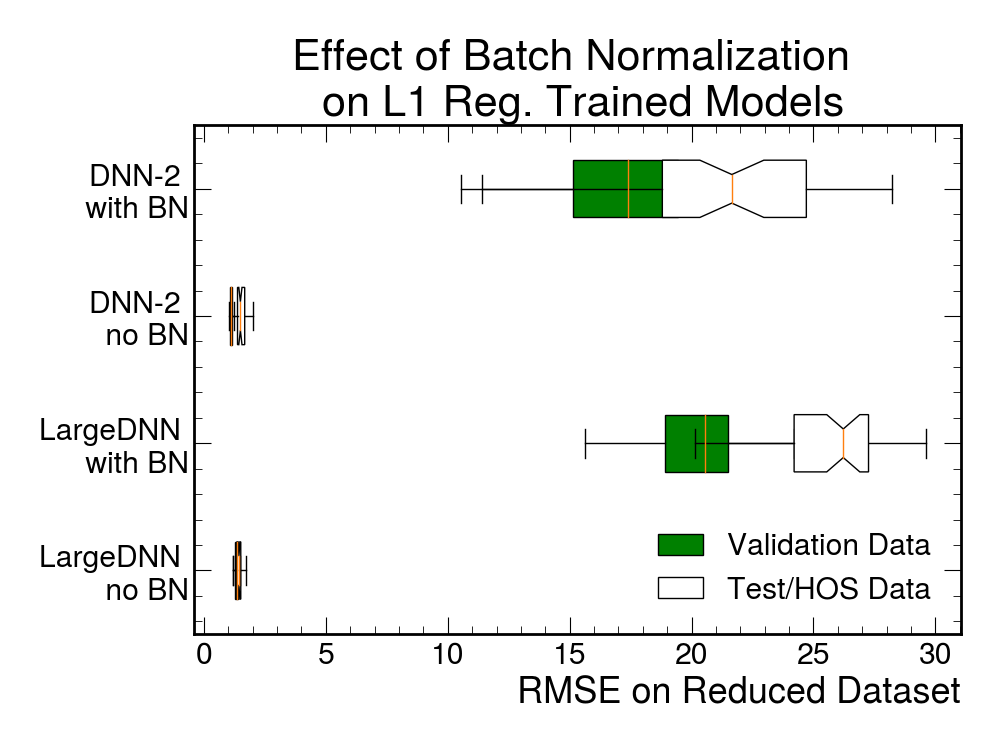

# Welcome to FAIR-UMN-CDMS

Welcome!

This is the project web-page for our project---FAIR-UMN-CDMS: Identifying Interaction Location in SuperCDMS Detectors.

In this project, we address the problem of accurately reconstruct the locations of interactions in theSuperCDMS detectors using machine learning methods. The approach is to use data collected with aradioactive source at known locations to train and qualify machine learning models.

## Detector and Its Data 

### Detector Information

A prototype SuperCDMS germanium detector was tested at the University of Minnesota with a radioactive source mounted on a movable stage that can scan from the edge to the center of the detector. The detector is disk-shaped with sensors placed on the top and bottom surfaces to detect the particles emitted by the radioactive source, which is shown in [Figure 1](https://).

<figure></figure>
 
<figcaption>Figure 1: A SuperCDMS dark matter detector.</figcaption>

The sensors measure phonons (quantized vibrations of the crystal lattice) that are produced by the interacting particle and travel from the interaction location to the sensors. The number of phonons and the relative time of arrival at a particular sensor depends on the positions of the interaction and
the sensor. The sensors are grouped into six regions on each side of the detector and each of these “channels” produces a waveform for every interaction. For the test performed at Minnesota, five channels on one side of the detector were used ([Figure 2](https://)). The movable radioactive source was used to produce interactions at thirteen different locations on the detector along a radial path from the central axis to close to the the detector’s outer edge ([Figure 3](https://)).

<figure></figure>
  
<figcaption>Figure 2: Pulses from an interaction in a SuperCDMS detector.</figcaption>

 

<figure></figure>
 
<figcaption>Figure 3: Interaction locations included in the dataset.</figcaption>

### Data from the Detector
For each interaction a set of parameters was extracted from the signals from each of the five sensors. These sets have been divided into two datasets which we will refer to as the **full** and **reduced** datasets.

The full dataset provides 85 input parameters for each interaction. These include 1 amplitude parameter and 16 timing/shape parameters for the waveforms for each of the 5 channels. The timing parameters represent time points during the rise and fall of the waveform at which the waveform reaches a given percentage of its maximum height. The parameters are given names such as PCr40 - the 40%-point for channel C as the waveform is rising; and PFf80 - the 80%-point for channel F as the waveform is falling. These times are referenced to PAr20, an early point on the waveform for Channel A, the outer channel. Thus PAr20 is always zero, reducing the number of independent parameters to 84. The amplitude parameter is a measure of the size of each waveform, based on a comparison to a normalized waveform template. The parameters included are:

- P[A,B,C,D,F]r[10,20,30,40,50,60,70,80,90,95,100]
- P[A,B,C,D,F]f[95,90,80,40,20]
- P[A,B,C,D,F]amp

The reduced dataset represents the input parameters that have been publicly released; it contains 19 input parameters which represent information known to be sensitive to interaction location, including the relative timing between pulses in different channels, and features like the pulse shape. The parameters included in the reduced dataset for each interaction are:

- P[B,C,D,F]start:
  - The time at which the pulse rises to 20% of its peak with respect to Channel A 
- P[A,B,C,D,F]rise:
  - The time it takes for a pulse to rise from 20% to 50% of its peak
- P[A,B,C,D,F]width:
  - The width (in seconds) of the pulse at 80% of the pulse height
- P[A,B,C,D,F]fall:
  - The time it takes for a pulse to fall from 40% to 20% of its peak

These parameters are illustrated in Figure 4.

<figure></figure>
  
<figcaption>Figure 4: Visualization of pulse timing and shape parameters in the reduced dataset.</figcaption>

The reduced dataset does not include amplitude parameters. Although the amplitudes are relevant to position reconstruction (particularly the relative amplitudes), they were omitted for technical reasons. During data taking it became clear that the gains of the sensors varied significantly from one data period to the next, and since each period represents a different source position, this introduces a bias in the dataset. For the full dataset, an attempt was made to adjust the amplitudes to correct for the variations with time. For this reason any studies involving the full dataset will be repeated both with and without pulse amplitude information.

## Machine Learning Solution

### Dataset for Machine Learning
We need to a large number of (x,y) paris to train our machine learning model. In our current experimental data, we have 19 and 85 informative features for the reduced and full datasets respectively, extracted
from 5 observed signals (pulses) and 13 different interaction locations (see our [document](https://github.com/FAIR-UMN/FAIR-UMN-CDMS/blob/main/doc/FAIR%20Document%20-%20Identifying%20Interaction%20Location%20in%20SuperCDMS%20Detectors.pdf) for details). In total, we obtain 7151 (x, y) pairs, of which the details are shown in [Table 1](https://). We further split our dateset to *Model-learning subset (MLS)* and *Held-out subset (HOS)*, of which the detailed definitions are provided in our [document](https://github.com/FAIR-UMN/FAIR-UMN-CDMS/blob/main/doc/FAIR%20Document%20-%20Identifying%20Interaction%20Location%20in%20SuperCDMS%20Detectors.pdf).

<figure></figure>
  

### Classical Regression Techniques

We use the classical linear regression techniques to obtain benchmark results for the impact location estimation problem. Along with the ordinary least-squared error (LSE) regression, we also look at regularized models using Ridge and Lasso Regression. Additionally, we use Principal Component Analysis (PCA) for dimensionality reduction and perform regression on PCA-transformed inputs.

<figure></figure>
  
<figcaption>Figure 5: The plot on the left shows how the model-predicted value compares with the true value for training, validation, and test/held-out datasets for an ordinary LSE regression. The plot on the right compares the RMSE losses from Lasso and Ridge regression models for the three datasets with the RMSE losses from the ordinary LSE regression model. These results are from the reduced dataset.</figcaption>

<figure></figure>
  
<figcaption>Figure 6: These plots compare the RMSE losses from Lasso and Ridge regression models for the training, validation, and test/held-out datasets with the RMSE losses from the ordinary LSE regression model. These results are from the full dataset without amplitude information (left) and with amplitude information (right).</figcaption>

  
  

<figure></figure>
  
<figcaption>Figure 7: These plots compare the RMSE losses from Lasso and Ridge regression models for the training, validation, and test/held-out datasets with the RMSE losses from the ordinary LSE regression model when PCA is used to reduce the input dataset. These results are from the extended dataset (left) w/o amplitude information and (right) with amplitude information. All models are use as many PCs as needed to account for 99% of the observed variance in the training data. For the three datasets considered, this required using 13, 14, and 16 PCs respectively.</figcaption>

<figure></figure>
  
<figcaption>Figure 8: Summary of validation (green) and test/held-out (white) RMSE Losses from different choices of dataset and regression model. The distributions of the losses are obtained from 20 different random splitting for the training and validation dataset while the HOS is kept the same for each case.</figcaption>

  

### Deep Neural Network Model
Our first approach to this problem is through a dense neural network implemented with Pytorch 1.9.0 3 . The framework of our neural network model is shown in Figure 9. It is a fully-connected network with non-linearity activation functions. In particular, in each hidden layer except the output layer, we employ a linear layer followed by the batch normalization, leaky rectified activation, and dropout. For the output layer, we simply pass the learned features through a linear layer and obtain its prediction directly. For other settings, please refer to our [document](https://github.com/FAIR-UMN/FAIR-UMN-CDMS/blob/main/doc/FAIR%20Document%20-%20Identifying%20Interaction%20Location%20in%20SuperCDMS%20Detectors.pdf).

In our experiments, we try neural networks with {2, 5, 10} hidden layers, indicating an increasing model complexity, and we set the number of neurons per hidden layer to be 32. To avoid the issue of overfitting, we employ dropout with a drop ratio of 0.5. We use Adam as our optimizer and exploit a constant learning rate which is 0.001. We set the maximum training epochs to be 500 epochs for each model. After 500 epochs of training, the neural network model converges well and does not show any overfitting based on the performance on both training and validation sets.

<figure></figure>
  
<figcaption>Figure 9: The framework of deep neural network models.</figcaption>

### Results of Deep Neural Network Models

We show the test performance on our test/held-out set in [Table 2](https://). We can observe that simply increasing the model complexity in this instance does not boost the performance on our dataset, rather it hurts the performance. Therefore, we argue that to achieve better performance, it is worth exploring novel network architectures or training paradigms. For more experimental results on these dense neural network models, please refer to our [document](https://github.com/FAIR-UMN/FAIR-UMN-CDMS/blob/main/doc/FAIR%20Document%20-%20Identifying%20Interaction%20Location%20in%20SuperCDMS%20Detectors.pdf).

<figure></figure>
  

### Larger Neural Network Training
Following the results from our initial attempts with the dense neural networks, we explored a different approach to our machine learning solution using varied network architectures and a new training method. Our previous results indicated that the set-up of our initial approach suffered from increasing network complexity. This can possibly be attributed to the use of dropout to prevent overfitting. Using the same drop ratio for increasing sizes of networks can be detrimental to network performance since larger networks will take a longer time to fit to data given their increased complexity. As a result, the drop ratio must be carefully readjusted for larger networks to ensure different components don’t drop out too early.

Rather than configure different drop ratios to find the optimal values for larger networks, we chose to replace dropout with a new method to combat overfitting that uses L1 regularization and early stopping. L1 regularization places a penalty on the network’s loss function proportional to the size of its weights, producing networks that should be less sensitive to changes in the input. As an additional measure we implement a procedure where we monitor the training and validation losses during training. If the training loss decreases while the validation loss increases, the training is automatically concluded and the network’s configuration is saved.

In the following experiments with this new training method we use L1 regularization with a penalty value of 1.0 and an early stopping procedure which monitors the validation loss with a patience of 1. As a result of the early stopping procedure in combination with more complicated network architectures, these training usually conclude within a dozen epochs and the training process tends to be much more stochastic. This means that network performance varies more significantly between training iterations using this updated training paradigm than it would using the previous dropout procedure. We display this stochastic nature by showing the results for 50 different network trainings with randomly generated seeds, with the overall performance shown in box plots.

### Larger Neural Network Architectures

For the following experiments we will introduce two new novel network architectures which we will refer to as the Large Dense Neural Network (Large-DNN) as well as a Convolutional Neural Network (CNN). These networks have been implemented using Keras Tensorflow 2.10.0 and will be evaluated on both the original and extended datasets.

Unless otherwise stated, we will continue to use the non-linear Leaky ReLu activation function for each of our input and hidden layers with a linear function for the output layer. In contrast to the prior dense neural network studies we will not make use of dropout (for the reasons above) or batch normalization between layers. The rationalization for removing the batch normalization from our larger networks is related to our new training method which uses L1 regularization. Batch normalization attempts to normalize the weights of our network while L1 regularization imposes a loss penalty to encourage the smallest weights possible. The two methods often end up countering each other out, resulting in worse empirical results as seen with some of our networks with batch normalization layers and trained with L1 regularization. This claim is demonstrated in Figure 10 which shows the effect of batch normalization upon two separate models which are trained with our L1 regularization and early stopping procedure.

<figure></figure>
  
<figcaption>Figure 10: RMSE losses for two different network architectures with and without batch normalization (BN). We observe that the presence of BN has a negative performance impact on networks trained with L1 regularization. </figcaption>

The Large-DNN is a fairly straightforward upscaling of the dense neural network that used used in our earlier studies, with additional hidden layers and approximately 12 times the number of trainable parameters as the original network to take advantage of the new training procedure as well as the increased size of the extended dataset. The full details of this network’s architecture are given below:

<figure></figure>
  

Additionally we introduce a more complicated architecture, making use of a convolutional neural network (CNN). The convolutional layer works by passing a “convolutional window” over the inputs such that it applies the same weights to each entry within its window. We set the parameters of this convolutional window such that the CNN’s convolution handles each of the five channels from the detector separately. The idea here is that this convolutional layer will act as a “featurizer,” which will pick out key properties from each of the channels’ input parameters. To accomplish this we set the kernel size of our convolutional layer equal to the amount of features per channel, as dispayed in Figure 11.

<figure></figure>
  
<figcaption>Figure 11: Visualization of the convolutional window (blue) that is passed over the inputs from the full dataset to the CNN. </figcaption>

The output from this input convolutional layer is then passed onto a Gated Recurrent Unit (GRU) layer. This layer contains several feedback connections that allow it to process entire sequences of data rather than single data points. This feature of recurrent neural networks make them ideal for predicting larger trends in data, and for this reason convolutional layers are often paired with GRUs in many applications of [natural language processing](https://www.hindawi.com/journals/itees/2022/1197534/), [audio processing](https://arxiv.org/abs/1702.07787), and other higher-complexity data prediction tasks. The outputs from our GRU hidden layer are then passed through a series of dense layers before returning our output.

## Support or Contact

Having trouble with codes or setting up? Check out our [documentation](https://github.com/FAIR-UMN/FAIR-UMN-CDMS/blob/main/doc/FAIR%20Document%20-%20Identifying%20Interaction%20Location%20in%20SuperCDMS%20Detectors.pdf) or [contact support](https://) and we’ll help you sort it out.
